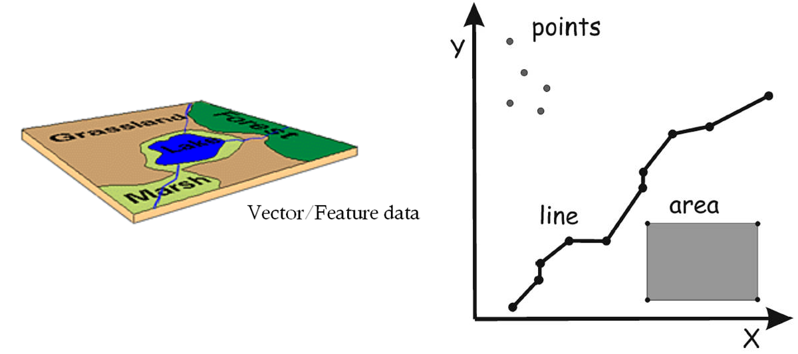
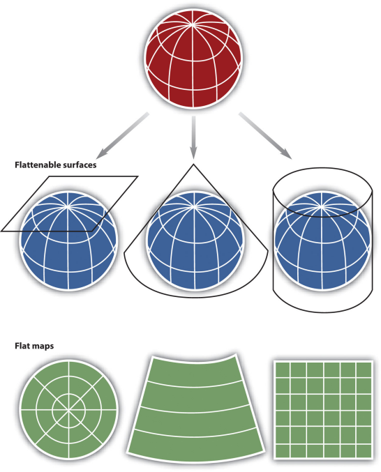
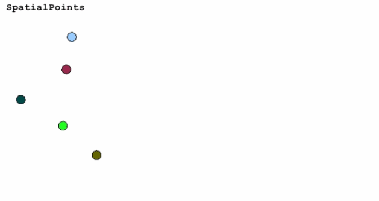
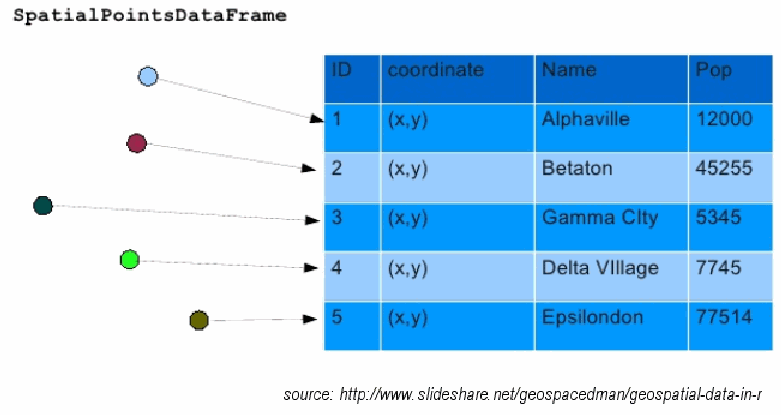
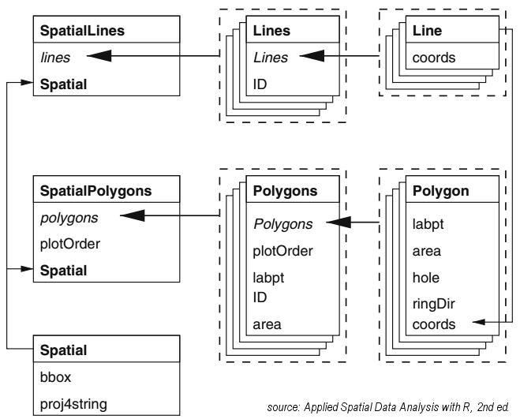

# Two-dimensional data

<script language="javascript" type="text/javascript">w3c_slidy.mouse_click_enabled = false;</script>

R has two object types for handling tabular data: **matrices** and **data frames**.

```{r}
head(airquality)
```

There are number of sample datasets that come with R, many of which are data frames. Functions to explore data frames include <tt>names()</tt>, <tt>head()</tt>, <tt>nrow()</tt>, <tt>ncol()</tt>, <tt>dim()</tt>.

```{r}
#View(mtcars)
names(mtcars)
head(mtcars)
nrow(mtcars)
ncol(mtcars)
```

You can grab an individual column by name with the <tt>$</tt> selector. 

```{r plot_wt_mpg, fig.align='center', cache=TRUE}
summary(mtcars$wt)
plot(x=mtcars$wt, y=mtcars$mpg, pch=16, main="Gas Mileage vs Weight")
```

# Filtering Rows and Columns

You can reference specific rows specific rows and columns with square bracket notation. Only this time we need two expressions separated by a comma.

<tt>mydataframe[</tt> *rows* , *cols* <tt>]</tt>

The expression for *rows* & *cols* can be integers (row and column indices), or Booleans. In addition, with data frames you can use a vector of column names to specific the columns. To return all the rows or all the columns, omit the expression. 

```{r}
library(maps)
data(canada.cities)
head(canada.cities)
```

Columns can be specified either by name or index number. The following two expressions are equivalent (note how the expression for *rows* has been omitted, so all rows are returned). 

```{r}
head(canada.cities[,1])
head(canada.cities[,"name"])
```

The *rows* expression can also be an expression that returns logicals.

```{r plot_big_cities, small.mar=TRUE, fig.align='center', cache=TRUE}
idx <- (canada.cities$pop > 100000)
table(idx)
big_cities <- canada.cities[idx,   ]
plot(big_cities[ , c("long","lat")], asp=1, pch=16  )
```

# Working with Files and Folders

Before importing or exporting data, you should set the working directory.

```{r eval=FALSE}
setwd("C:/.../.../data)
```

<div class="tip">
You can also set the working directory in RStudio from the Session menu 
</div>

# Importing a csv

<div class="tip">
RStudio has a 'import dataset' tool in the upper right pane. 
</div>

```{r import_evictions}
evict_df = read.csv("./data/Eviction_Notices.csv")
```

# Spatial Data

<script language="javascript" type="text/javascript">w3c_slidy.mouse_click_enabled = false;</script>

```{r setup, child = 'slides_setup.Rmd', include=FALSE}
```

## Physical World &rarr; GIS World

<div class="incremental centerblock" style="margin-bottom:2em;"></img></div>

<div class="incremental centerblock" style="margin-bottom:2em;"></img></div>

<div class="incremental centerblock" style="margin-bottom:2em;"></img></div>

# Representing Geographic Data 

How would you represent each of the following?

<div class="indented2">
- city, county, state boundaries
- air or ocean temperature
- crime locations
- buildings
- roads
- water fountains
- elevation
- soil type
- land use
</div>

# Projections

<div class="centerblock"></img></div>

<div class="centerblock" style="margin-top:2em;">
<iframe src="https://www.jasondavies.com/maps/transition/" style="width:1234px;height:732px;">
  <p>Your browser does not support iframes.</p>
</iframe>
</div>

# ```sp``` package

<script type="text/javascript">w3c_slidy.mouse_click_enabled = false;</script>

```{r setup, child = 'slides_setup.Rmd', include=FALSE}
```

```{r loadlibraries, include=FALSE}
library(rgdal)
```

## Spatial Data Classes from the ```sp``` package

<div class="indented1">
__Vector data classes__

```SpatialPoints, SpatialPointsDataFrame```

```SpatialLines, SpatialLinesDataFrame```

```SpatialPolygons, SpatialPolygonsDataFrame```

__Raster classes__

```SpatialPixels```

```SpatialGrid```
</div>

<div class="textbox">
To see all data classes that inherit from 'Spatial', run ```getClass('Spatial')```
</div>

## <tt>Spatial*</tt> Data Classes

<div class="indented2">
- all sp* objects store _projection info_
- it's relatively easy to _convert_ data types within and between packages
- standard _data frame syntax_ will often work with sp* objects
- many spatial analysis packages take sp* objects _directly_ or have conversion functions
</div>

__SpatialPoints__

<div class="indented2">



</div>

__Structure of Spatial* Objects__

<div class="indented2">
 
</div>

# Managing Projections

## Background

<div class="indented2">
 - __CRS__ (Coordinate Reference System) is the umbrella term for both projection systems and geographic (lat-long) coordinates.
 - all of the data classes from the ```sp``` package store projection info
 - all of the import functions from the ```rgdal```, ```raster```, and ```maptools``` packages read projection info
 - ```CRS()``` is used to specify the parameters of a project system, you can also 'lookup' a projection system using an id number
 - when creating spatial objects from scratch, you don't have to specify a CRS (but its highly recommended, particularly if your spatial object is geospatial)
</div>

## Specifying Projection Systems

The ```CRS()``` function uses the *PROJ.4* library, which has at least three ways to specify a projections:

<div class="indented2">
- specially formatted strings
- epsg numbers
- ESRI numbers
</div>

```{r define_prj}
library(sp)
prj1 <- CRS("+proj=utm +zone=17 +datum=WGS84")
prj2 <- CRS("+init=epsg:3358")
prj3 <- CRS("+init=ESRI:102719")
```

The one-stop shop for finding proj4 strings and epsg/ESRI id numbers is [http://www.spatialreference.org](http://www.spatialreference.org){target="_blank"}. (Google usually works also. 

## Geographic Coordinates

Even though geographic coordinates (latitude-longitude) are not projected, it is still a coordinate reference system.

```{r define_ll}
## The following are equivalent
latlong1_crs <- CRS("+proj=longlat +datum=WGS84")
latlong2_crs <- CRS("+init=epsg:4326")
```

## UTM

[Universal Transverse Mercator](https://en.wikipedia.org/wiki/Universal_Transverse_Mercator_coordinate_system){target="_blank"} is a popular projection system that like all conformal Mercator projections preserves angles. It divides the world into [36 zones](https://en.wikipedia.org/wiki/File:Utm-zones-USA.svg){target="_blank"} of 6 degrees each, so you need to know which zone your areas falls in. Areas below the equator can also be flagged with `+south` which will add an offset so y values are positive. It works well for areas the size of a county or smaller. Units are meters.

```{r utm_prj}
library(sp)
utm10n <- CRS("+proj=utm +zone=10 +datum=WGS84")
```

## Web Mercator

Another common projection system is [Web Mercator](http://spatialreference.org/ref/sr-org/epsg3857-wgs84-web-mercator-auxiliary-sphere/){target="_blank"}. Web Mercator is used by many popular mapping platforms, such as Google Maps, Bing, and Open Street Map. Web mapping packages such as <tt>leaflet</tt> and <tt>ggmap</tt> will typically project lat-long data into WebMercator on the fly, but if you ever need to project data into Web Mercator its EPSG number is 3857.

```{r define_webm}
webmercator_crs <- CRS("+init=epsg:3857")
```

For more info, see: [Coordinate Reference Systems in R](https://www.nceas.ucsb.edu/~frazier/RSpatialGuides/OverviewCoordinateReferenceSystems.pdf){target="_blank"} (cheat sheet) 

# Reading Projection Info When Importing

The majority of spatial data file formats save the projection information as part of the file(s). As we saw last time, this includes Shapefiles that we can import using the <tt>rgdal</tt> package.


```{r import_shp_prj_info, echo=TRUE}
library(rgdal)
ca_counties <- readOGR(dsn="./data", layer="ca_counties_census", verbose=FALSE)
plot(ca_counties, axes=TRUE)
```

# Getting or Setting the CRS  

All data classes from the _sp_ and _raster_ packages have a ```proj4string``` slot

```{r projslot}
ca_counties@proj4string
```

<div style="margin-left:3em;border:1px solid grey;">
*Challenge question*: What projection system is this? [<span id="qtn_hismynn" class="showhide" style="cursor: pointer; color:blue;" onclick="showHide('hismynn');return false;">Ans</span>].

<div id="hismynn" class="answer-code">
This is [California Teale Albers NAD83](http://www.spatialreference.org/ref/sr-org/10/){target="_blank"} (if you figured that out you're truly a geo-geek).
</div>
</div>

You can also get or set the CRS info using the ```proj4string()``` function

```{r proj4functn}
proj4string(ca_counties)
```

Both of these methods can be used to read or write the CRS info, However this only telling R how your data are saved, it is _not_ actually projecting anything (that's next!) 

## (Re)projecting data

<div class="indented2">
- R does not do on-the-fly projecting. To overlay or fuse spatial data, all layers need to be in same CRS
- ```spTransform()``` is your go-to function for projecting and transforming
</div>

Let's 'unproject' the CA Counties back to geographic coordinates.

```{r ca_counties_ll, cache=TRUE}
latlong_crs <- CRS("+proj=longlat +datum=WGS84")
ca_counties_ll <- spTransform(ca_counties, latlong_crs)
plot(ca_counties_ll, axes=TRUE)
```

# Creating New Spatial objects 

## SpatialPoints

We can create a _SpatialPoints_ object by passing a two-column data frame or matrix containing the _x_ and _y_ coordinates to the ```SpatialPoints()``` function.

To illustrate, let's grab the _us.cities_ data frame (cities with pop > 40k), which is bundled with the  ```maps``` package. Next we'll extract just the cities in California.

```{r calcitiesDF}
library(maps)
head(us.cities)
ca_citiesDF <- us.cities[us.cities$country.etc=="CA", ]
nrow(ca_citiesDF)
head(ca_citiesDF)
```

To turn these into a _SpatialPoints_ object, we need to pass just the columns containing the x and y coordinates to the ```SpatialPoints()``` function. In this case, the _long_ column contains the x-coordinates, and the _lat_ column contains the y-coordinates.

```{r calcitiesSP}
ca_citiesSP <- SpatialPoints(ca_citiesDF[ , c("long", "lat")])
summary(ca_citiesSP)
```

Note the proj4string is missing. Let's tell R what CRS these points are in before we do anything else.

```{r calcitiesSP_addp4s}
proj4string(ca_citiesSP) <- CRS("+proj=longlat +datum=WGS84")
```

Now we can plot them on top of the counties.

```{r calcities_plot, cache=TRUE}
plot(ca_counties_ll, asp=1, axes=T)
plot(ca_citiesSP, add=TRUE, pch=16, cex=1, col="red")
```

## SpatialPointsDataFrame

If we want to retain the attribute table (e.g., the name and population of every city), we need to create a SpatialPoints<span style="font-weight:bold;">DataFrame</span>. ```SpatialPointsDataFrame()``` is pretty similar to its shorter cousin, but also wants you to pass an argument called _data_ with the attribute table (data frame). While we're at it, we can also pass the _proj4string_ argument.

```{r cacites_spdf}
ca_citiesSPDF <- SpatialPointsDataFrame(coords=ca_citiesDF[,c("long","lat")], data=ca_citiesDF, proj4string = CRS("+proj=longlat +datum=WGS84"))
summary(ca_citiesSPDF)
```

Now that we have attributes, we can color the points by population size. First we'll put the population values into 10 'bins' using the ```cut()``` function, and then use the bin numbers to assign a color.

```{r calcitiespop_plot, cache=TRUE}
pop_deciles <- quantile(ca_citiesSPDF@data$pop, probs = 0:10/10)
pop_bin_factor <- cut(ca_citiesSPDF@data$pop, breaks=pop_deciles)
pop_bin_num <- as.numeric(pop_bin_factor)
table(pop_bin_num)
plot(ca_counties_ll, asp=1, axes=T)
plot(ca_citiesSPDF, add=TRUE, pch=16, cex=1, col=topo.colors(10)[pop_bin_num])
```

# Attribute Queries

Spatial*DataFrame objects are designed to work as similarly as possible as regular data frames. This means you can reference columns the way you always do, use the [rows,cols] syntax to pull out selected rows, append two SPDF objects together using the ```rbind()``` function, get the number of rows with ```nrow()```, etc.  

The attached data frame is saved in the ```data``` slot, so you grab it using the <tt>@</tt> operator, as in: 

my_spatial_object<span style="font-weight:bold;">@data</span>

```{r cacites_names}
## Look at the names of the columns
names(ca_counties_ll@data)
```

Let's pull out one county and plot it. To perform an attribute query, you need to know the range of values.

```{r sanmateo, cache=TRUE}
ca_counties_ll@data$CountyNAME
```

To grab just one county, we can use [square bracket notation] with an expression in the *rows* position.  

```{r}

sanMateoCtyLL <- ca_counties_ll[ca_counties_ll@data$CountyNAME=="San Mateo County",]

summary(sanMateoCtyLL)
plot(sanMateoCtyLL, axes=TRUE, asp=1, main="San Mateo", col=gray(0.8))
```

With a similar technique, we can randomly select five counties:

```{r rand_cty, cache=TRUE}
idx <- sample(1:nrow(ca_counties@data), size=5, replace = FALSE)
idx

plot(ca_counties, axes=TRUE, asp=1)
plot(ca_counties[idx,], col=palette(), add=TRUE)
```

# Getting the Coordinates

Sometimes you need to get the coordinates of the features in a SpatialPoints object 'back' as a simple matrix, so you can do something else with them (such as compute distances). The *sp* package has a function <tt>coordinates()</tt> which does exactly this. 

```{r}
x <- coordinates(ca_citiesSP)
head(x)
```

# Getting Rid of the Data Frame

There are times when you want to get rid of the data frame, in otherwords convert a *SpatialPointsDataFrame* object into a simply *SpatialPoints* object. The <tt>geometry()</tt> function will do this for you. It will also work on *SpatialLines\** and *SpatialPolygons\** objects.

```{r}
x <- geometry(ca_citiesSPDF)
class(x)
```

# Importing Vector Data: rgdal

<div class="indented1">
- <tt>rgdal</tt> is a wrapper for the Geospatial Data Abstraction Library (GDAL) library.  
- It provides drivers for a wide range of vector and raster data formats. [<a id="qtn_vqmbij" href="#" class="showhideplain" onclick="showHide('vqmbij');return false;">See all</a>]  

<div id="vqmbij" class="answer-code">
```{r}
library(rgdal)
rgdal::ogrDrivers()[,c(2,3,4)]
```
</div>

- Data come in as Spatial* objects (<tt>sp</tt> package).  
- Knows how to read project info  
</div>

```{r echo=TRUE, results='hide', message=FALSE}
library(sp)
library(rgdal)
```

## Import Shapefiles

View layers in a directory:

```{r echo=TRUE, eval=FALSE}
library(rgdal)
rgdal::ogrListLayers(dsn)
```

Where _dsn_ is a directory.

```{r}
rgdal::ogrListLayers("./data")
```

View metadata before importing:

```{r echo=TRUE, eval=FALSE}
rgdal::ogrInfo(dsn, shape_file_name)
```

where _shape_file_name_ is the name of the directory, minus the _.shp_ extension

To import, use ```readOGR()```

```{r import_shp, echo=TRUE}
ca_counties_alb <- rgdal::readOGR("./data", "ca_counties_census")
summary(ca_counties_alb)
```

## Import a KML

```{r import_kml, echo=TRUE}
kml_fn <- "./data/berkeley_public_sites.kml"
file.exists(kml_fn)
rgdal::ogrListLayers(kml_fn)
brk_sites <- rgdal::readOGR(kml_fn, "Public Facilities")
summary(brk_sites)
```

## Import from a Geodatabase

rgdal can import from a file geodatabase also. In this case, the source is the name of a directory.

```{r plot_sfcrimes, cache=TRUE, fig.align='center', small.mar=TRUE}
gdb_dir <- "./data/sf_crime.gdb"
file.exists(gdb_dir)
sfcrime_sp <- rgdal::readOGR(dsn=gdb_dir,layer="San_Francisco_Crimes")
class(sfcrime_sp)
names(sfcrime_sp@data)
plot(sfcrime_sp, pch=16, cex=0.4, axes=T, asp=1)
```

## Exporting

To determine if you can *export* as well as import a specific file format, look at the OGR driver info by running <tt>ogrDrivers()</tt>.

```{r}
subset(ogrDrivers(), grepl("ESRI", name))
subset(ogrDrivers(), grepl("KML", name))
subset(ogrDrivers(), grepl("GDB", name))
```

